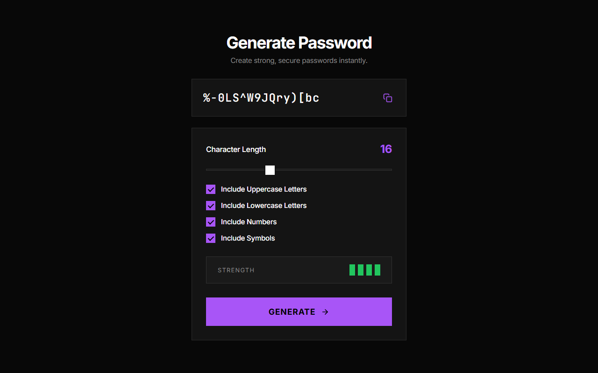

# Secure Password Generator

## Description
A highly customizable and secure random password generator. Designed with a dark Tactile Brutalism aesthetic, this tool helps you instantly generate strong passwords and copy them to your clipboard with a single click.

## Live Demo
[Live Demo Link](https://ayushkumar563.github.io/password-generator/)

## Tech Stack
- **HTML5** 
- **CSS3** (Tactile Brutalism, sharp UI edges, CSS Variables, Custom Range Sliders)
- **JavaScript (ES6)** (Vanilla JS, Clipboard API, Dynamic Strength Calculation)

## Features
- Choose password length (8-32 characters).
- Toggle Uppercase, Lowercase, Numbers, and Symbols.
- Visual strength indicator based on complexity rules.
- One-click copy to clipboard functionality.

## How to Open / Run
1. Clone or download this repository.
2. Navigate to the `password-generator/` directory.
3. Open `index.html` in your web browser. No server required.
